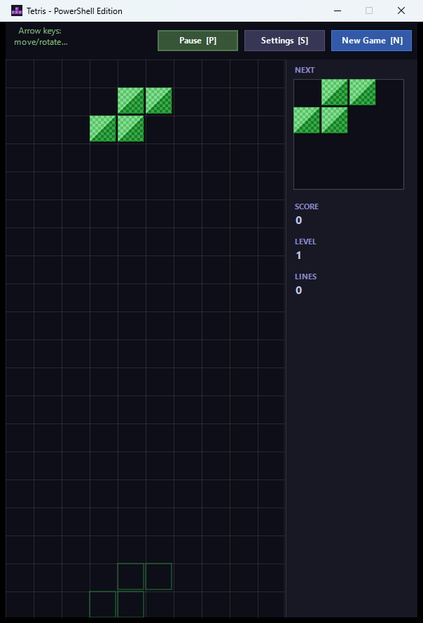
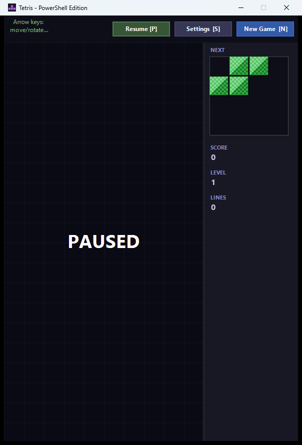
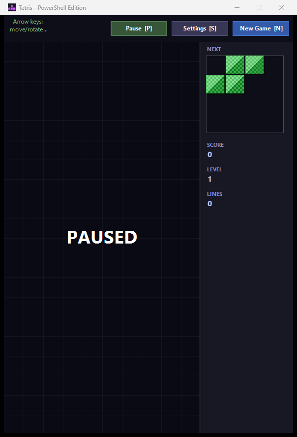

# Tetris — PowerShell Edition

Classic Tetris clone built with PowerShell, Windows Forms, and GDI+.



---

## Requirements

- Windows
- PowerShell 5.1 or later

## Running

```powershell
powershell -ExecutionPolicy Bypass -File Tetris.ps1
```

## Controls

| Key | Action |
|-----|--------|
| Left / Right | Move piece horizontally |
| Up | Rotate clockwise |
| Z | Rotate counter-clockwise |
| Down | Soft drop (+1 pt per row) |
| Space | Hard drop (+2 pts per row) |
| P | Pause / Resume |
| N | New game |
| S | Settings |



## Scoring

| Lines cleared | Points (× level) |
|--------------|-----------------|
| 1 | 100 |
| 2 | 300 |
| 3 | 500 |
| 4 (Tetris) | 800 |

Soft drop awards 1 point per row; hard drop awards 2 points per row.

A new level is reached every 10 lines. Speed increases with each level up to level 11.

## Settings

Press **S** or click the Settings button to adjust board width (6–16 columns), board height (10–30 rows), and starting level (1–11). Changes take effect on the next new game.



## Running Tests

```powershell
powershell -ExecutionPolicy Bypass -File Tetris.Tests.ps1
```
